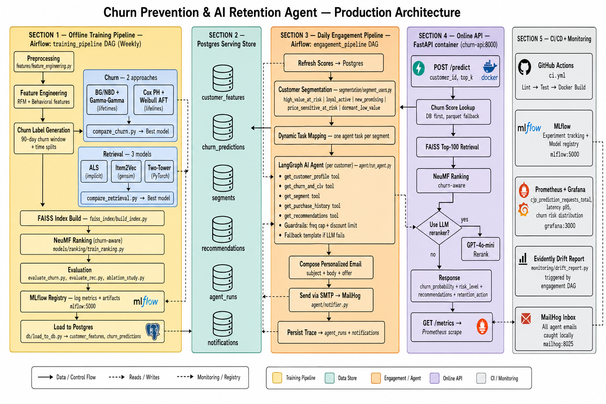

# Churn Prevention System + AI Retention Agent

An end-to-end, production-like ML system that combines **Churn Prediction**, a **Recommendation System**, and a **LangGraph AI Retention Agent** that proactively segments customers, retrieves their history, composes personalized outreach, and sends email notifications — all orchestrated by Apache Airflow.

---

## Project Objective

1. **Predict churn** using BG/NBD and Survival Analysis models
2. **Recommend products** using ALS, Item2Vec, and Two-Tower retrieval models
3. **Rank recommendations** with a churn-aware NeuMF model
4. **Segment customers** by churn risk + CLV + RFM into actionable playbooks
5. **Run an AI agent** (LangGraph + OpenAI) per customer that retrieves history, reasons about retention strategy, and sends a personalized email
6. **Orchestrate everything** with Airflow (weekly training DAG + daily engagement DAG)
7. **Serve predictions** via a hardened FastAPI with API-key auth and Prometheus metrics
8. **Track experiments** in MLflow and monitor drift with Evidently + Grafana

---

## Architecture

### v2 — Production (current)


### v1 — Original batch pipeline


---

## Production Stack

| Service | Purpose | Local URL |
|---------|---------|-----------|
| `churn-api` | FastAPI: predictions, auth, `/metrics` | http://localhost:8001/docs |
| `postgres` | Serving store + Airflow/MLflow metadata | localhost:5432 |
| `airflow` | DAG orchestration (training + engagement) | http://localhost:8080 |
| `mailhog` | Mock SMTP inbox — catches all agent emails | http://localhost:8025 |
| `mlflow` | Experiment tracking + model registry | http://localhost:5000 |
| `grafana` | Monitoring dashboards | http://localhost:3000 |
| `prometheus` | Metrics collection | http://localhost:9090 |

> **Grafana login:** admin / admin
> **Airflow login:** airflow / airflow
> **API key (x-api-key header):** `local-dev-key`

---

## Quick Start

### Prerequisites
- Docker Desktop running
- Python 3.10+ (for local scripts)
- Kaggle API credentials (for dataset download)

### Step 1 — Configure environment
```bash
cp .env.example .env
# Open .env and add your OPENAI_API_KEY (optional — falls back to template emails)
```

### Step 2 — Download dataset
```bash
python download_data.py
```

### Step 3 — Start the full stack
```bash
docker compose --profile all up -d --build
```

Wait ~60 seconds for all services to initialize.

### Step 4 — Train models
Either trigger the `training_pipeline` DAG in Airflow (http://localhost:8080), or run directly inside the container:
```bash
docker compose run --rm churn-api bash models/train_all.sh
```

### Step 5 — Run the engagement pipeline
In Airflow UI (http://localhost:8080):
1. Enable the `engagement_pipeline` DAG
2. Trigger a manual run
3. Watch personalized emails arrive at **http://localhost:8025** (MailHog)

---

## API Usage

The `/predict` and `/customers` endpoints require the `x-api-key` header. `/health` and `/metrics` are open.

```bash
# Health check
curl http://localhost:8001/health

# Predict churn + get recommendations
curl -X POST http://localhost:8001/predict \
  -H "Content-Type: application/json" \
  -H "x-api-key: local-dev-key" \
  -d '{"customer_id": 13085, "top_k": 10}'
```

PowerShell:
```powershell
Invoke-RestMethod -Method POST -Uri "http://localhost:8001/predict" `
  -Headers @{"Content-Type"="application/json"; "x-api-key"="local-dev-key"} `
  -Body '{"customer_id": 13085, "top_k": 10}'
```

---

## Run the AI Agent Manually

```bash
# 1. Load trained model outputs into Postgres
python db/load_to_db.py

# 2. Segment all customers
python segmentation/segment_users.py

# 3. Run the agent for one customer
python agent/run_agent.py --customer-id 13085

# 4. Run the agent for a whole segment (top 20 by priority)
python agent/run_agent.py --segment high_value_at_risk --limit 20
```

Check emails at http://localhost:8025 and traces in the `agent_runs` table in Postgres.

---

## Customer Segments

| Segment | Playbook | Description |
|---------|---------|-------------|
| `high_value_at_risk` | win_back_premium | High spend, elevated churn risk — intervene aggressively |
| `loyal_active` | reward_loyalty | Healthy, engaged — reward and upsell |
| `new_promising` | nurture_onboarding | Recently acquired with momentum — build the habit |
| `price_sensitive_at_risk` | value_offers | At risk and price-driven — lead with value/bundles |
| `dormant_low_value` | light_touch_winback | Low value, likely gone — lightweight win-back |
| `standard` | standard_recommendations | Stable mid-tier — standard personalized recs |

---

## Evaluation Metrics

| Model | Metrics |
|-------|---------|
| Churn | AUC-ROC, Precision, Recall, F1-Score |
| Recommendation | Recall@K, NDCG@K |
| Ablation study | Churn only vs +Retrieval vs Full pipeline vs LLM |

---

## Tech Stack

| Component | Technology |
|-----------|------------|
| Churn Models | lifetimes (BG/NBD), lifelines (Survival) |
| Retrieval | implicit (ALS), gensim (Item2Vec), PyTorch (Two-Tower) |
| Vector Search | FAISS |
| Ranking | PyTorch (NeuMF, churn-aware) |
| AI Agent | LangGraph + OpenAI tool-calling |
| Serving Store | PostgreSQL + SQLAlchemy |
| Orchestration | Apache Airflow (LocalExecutor) |
| Notifications | SMTP → MailHog (local) |
| Experiment Tracking | MLflow |
| Monitoring | Prometheus + Grafana, Evidently (drift) |
| API | FastAPI + Uvicorn |
| Config | pydantic-settings (env-driven) |
| Deployment | Docker Compose (multi-profile) |
| CI/CD | GitHub Actions |

---

## Project Structure

```
├── config.py                   # ML hyperparameters & on-disk paths
├── settings.py                 # Env-driven runtime config (DB, SMTP, agent, MLflow)
├── download_data.py            # Dataset download from Kaggle
├── features/
│   └── feature_engineering.py # RFM + behavioral features, churn labels
├── models/
│   ├── churn/                  # BG/NBD + Survival Analysis
│   ├── retrieval/              # ALS, Item2Vec, Two-Tower
│   ├── ranking/                # NeuMF (churn-aware)
│   └── reranker/               # One-shot LLM reranker
├── faiss_index/                # FAISS ANN index builder
├── db/                         # SQLAlchemy models, Postgres loader, repository
├── segmentation/               # Churn + CLV + RFM → actionable segments
├── agent/                      # LangGraph agent: tools, graph, notifier, guardrails
├── dags/                       # Airflow DAGs: training_pipeline + engagement_pipeline
├── monitoring/                 # Evidently drift reports
├── api/                        # FastAPI: lifespan, auth, /metrics, inference engine
├── evaluation/                 # Metrics & ablation study
├── tests/                      # Unit tests (pipeline + agent + segmentation + DAGs)
├── docker/                     # Dockerfiles + Postgres/Prometheus/Grafana config
├── .github/workflows/          # CI/CD pipeline
├── Dockerfile                  # API image
├── docker-compose.yml          # Full production-like stack (profiles: airflow, monitoring, all)
├── requirements.txt            # API + test dependencies
├── requirements-airflow.txt    # Airflow image deps (agent, mlflow, evidently)
├── .env.example                # Environment template (copy to .env)
└── system_architecture_v2.png  # Production architecture diagram
```

---

## What's Next (Production Roadmap)

| Priority | Next Step |
|----------|-----------|
| High | **Close the feedback loop** — capture email open/click/purchase outcomes back into `notifications` and use them as training labels |
| High | **Uplift / A-B testing** — add a holdout control group and T-/S-learner CATE modeling so discounts only go to customers the intervention actually changes |
| Medium | **Business KPIs** — track retention uplift, incremental revenue, offer ROI; enforce unsubscribe/GDPR |
| Medium | **Auto retraining triggers** — data drift + model decay automatically kick off the `training_pipeline` DAG |
| Medium | **LLM safety** — offline message-quality eval set, PII scrubbing, cost tracking, human-in-the-loop for high-value offers |
| Low | **Feature store** — evolve `customer_features` toward Feast when latency/scale demands it |

---

## Dataset

**Online Retail II (UCI)** — Real-world e-commerce transactions from a UK-based retailer.
Source: [Kaggle](https://www.kaggle.com/datasets/mashlyn/online-retail-ii-uci)
